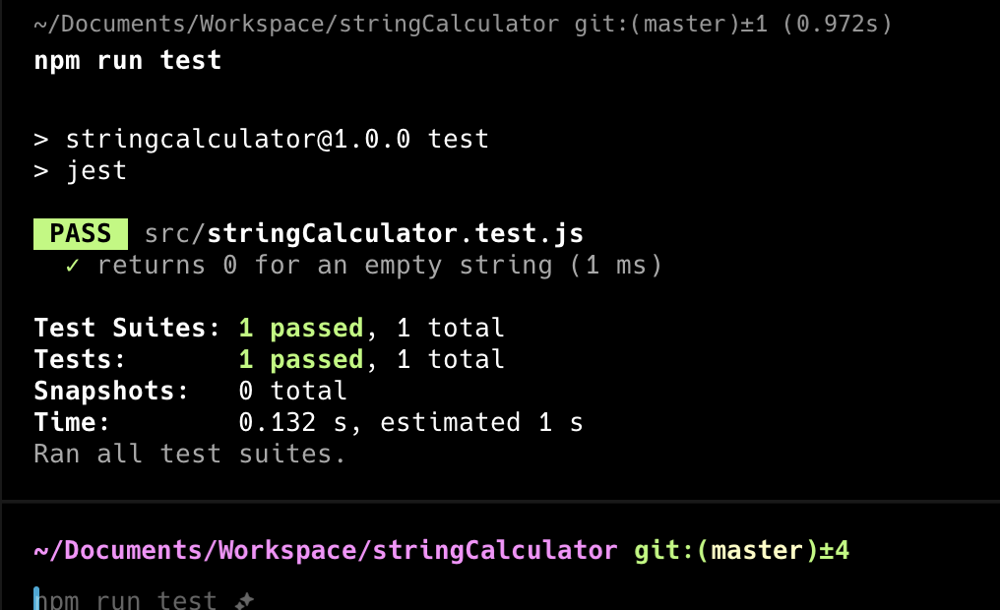
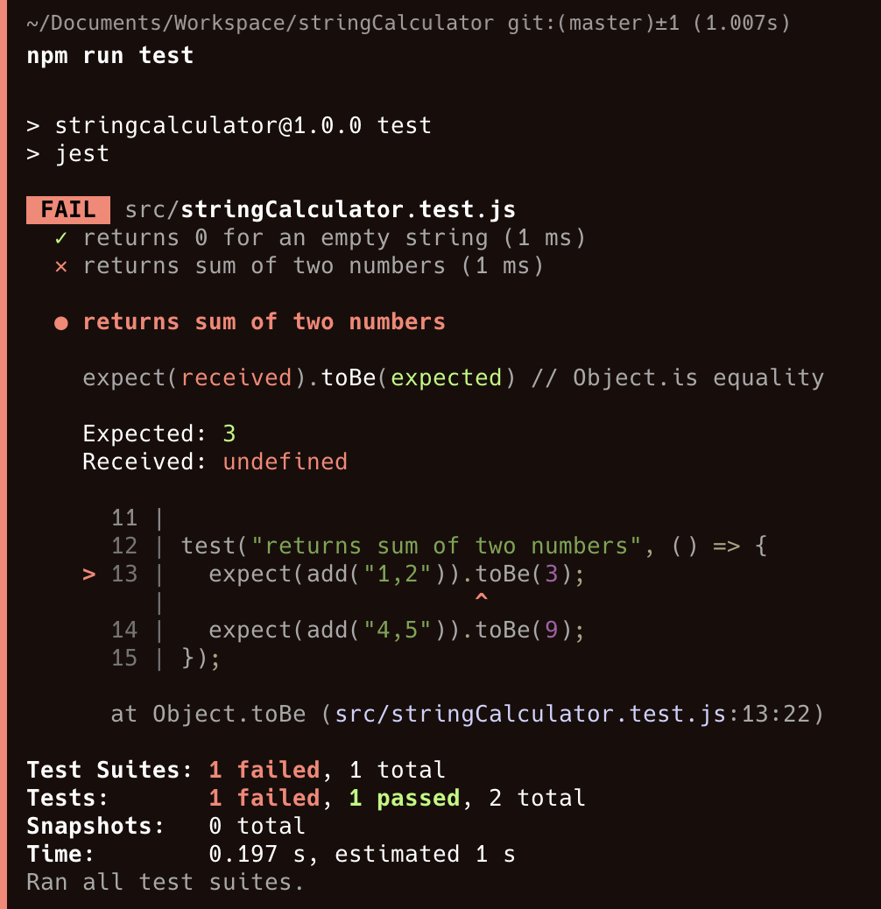
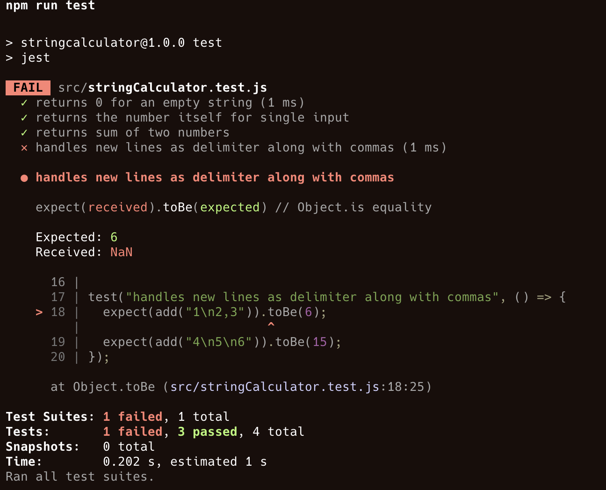
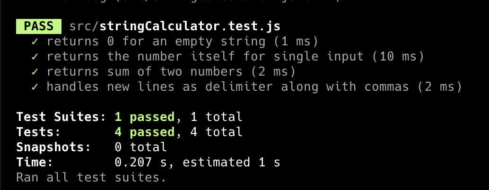
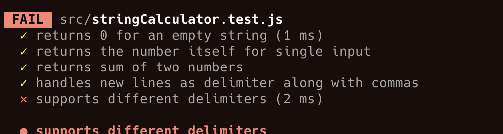
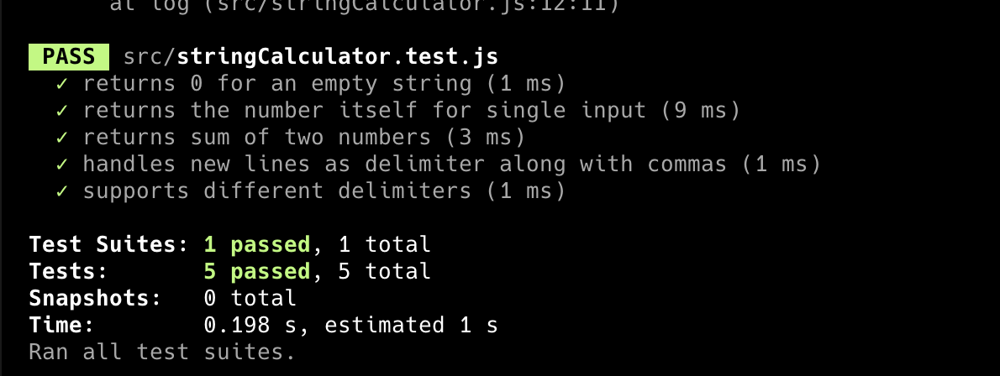
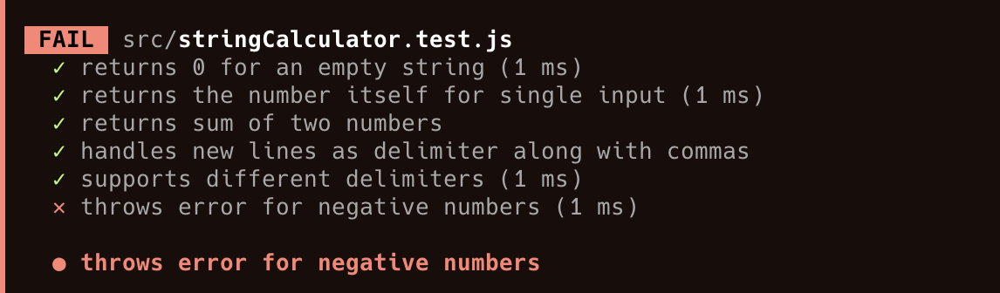
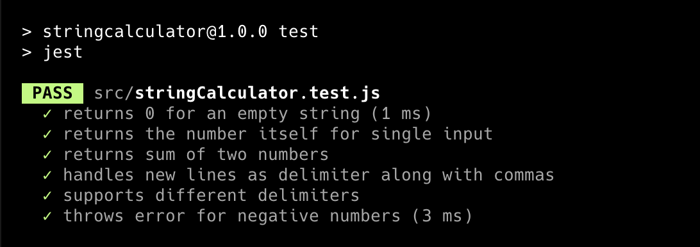

# String Calculator TDD Kata

### First Test Failure – "add function is not defined"![alt text]
(image.png)

### Test Passed – Implemented the add function

### Handle multiple numbers separated by a comma (Failing)

### Handle multiple numbers separated by a comma (Passed)

### Handle new line as a delimiter (Failing)

### Handle new line as a delimiter (Passed)

### Handle custom delimiter (Failing)

### Handle custom delimiter (Passed)

### Handle negative numbers (Failing)

### Handle negative numbers (Passed)

