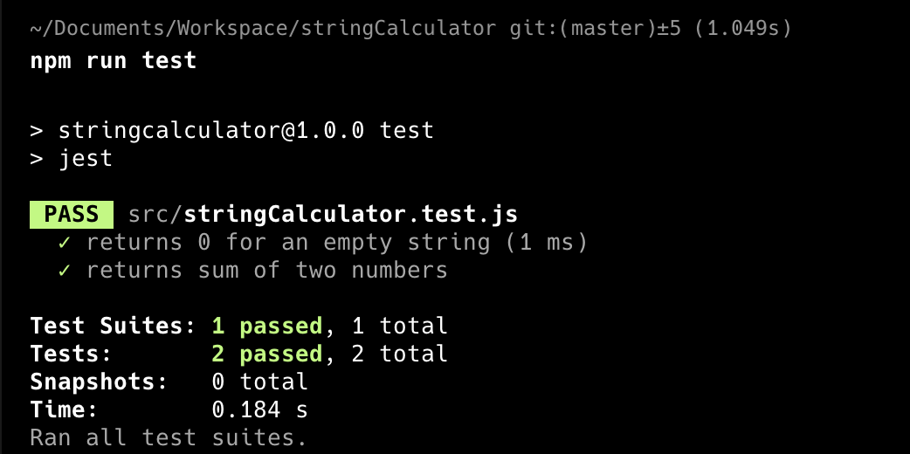

# String Calculator TDD Kata

### Phase 1: First Test Failure – "add function is not defined"

### Phase 2: Test Passed – Implemented the add function

### Phase 3: Handle multiple numbers separated by a comma (Failing)

### Phase 4: Handle multiple numbers separated by a comma (Passed)

